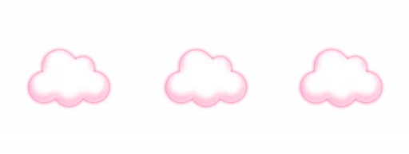

   

  

<table>
  <tr>
    <td valign="top" width="35%">
      
    </td>
    <td valign="top" width="65%">

<pre><code>(ﾉ◕ヮ◕)ﾉ*:･ﾟ✧ hi hi
-------------------------
🌸 about
- random random random hiks
- gatawu mau nulis apa xixi:3
- hii, aku nadchan.
</code></pre>

  
  
  
  
   

  </tr>
</table>

  

 
<!--START_SECTION:waka-->
<!--END_SECTION:waka-->
